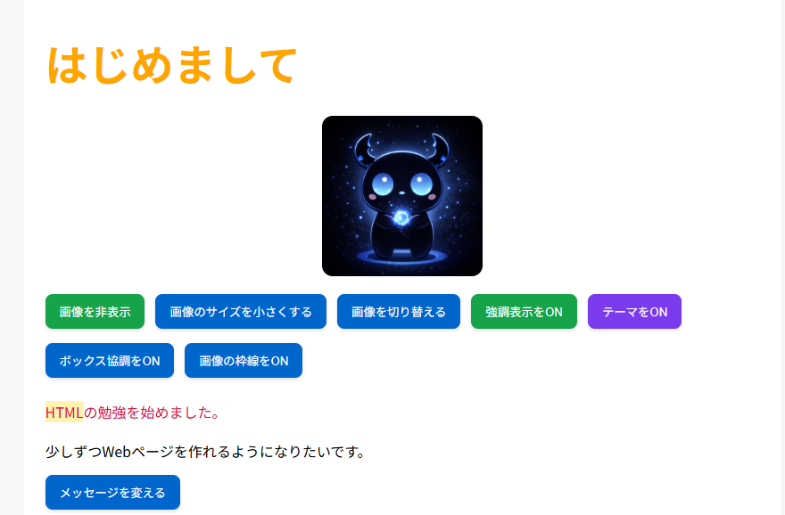
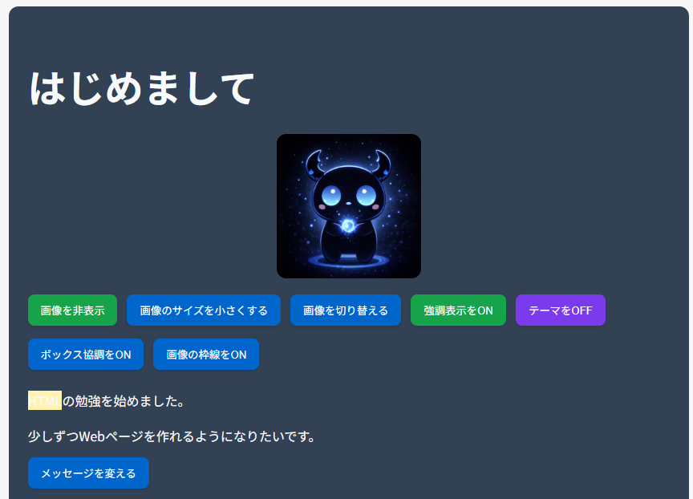

# web-study

HTML / CSS / JavaScript の学習用として作成したWebページです。  
機能少しずつを追加しながら、見た目と動きを改善しています。

---

## 🔧 主な機能

- 画像の表示 / 非表示切り替え
- 画像サイズの変更
- 画像の切り替え
- メッセージの変更（トグル）
- テキストの強調表示 ON / OFF
- テーマカラーの切り替え
- ボックスの強調表示
- 画像の枠線 ON / OFF

---

## 🌐 公開ページ

👉 https://niltorei-lab.github.io/web-study/

---

## 📸 スクリーンショット

<table>
  <tr>
    <td align="center"><strong>通常表示</strong></td>
    <td align="center"><strong>テーマ変更後</strong></td>
  </tr>
  <tr>
    <td></td>
    <td></td>
  </tr>
</table>

---

## 🧠 学習内容

- HTML（構造の作り方）
- CSS（レイアウト / デザイン / Flexbox）
- JavaScript（DOM操作 / イベント処理）
- GitHub（リポジトリ管理 / Pagesでの公開）

---

## ✍️ 今後やりたいこと

- レスポンシブ対応を進める
- 余白や配置などのデザインを改善する
- アニメーションを追加する
- 再利用しやすいコードの整理に整理する

---

## 📝 メモ

初めてGitHub Pagesで公開したWebページです。  
少しずつ改善していく予定です。
